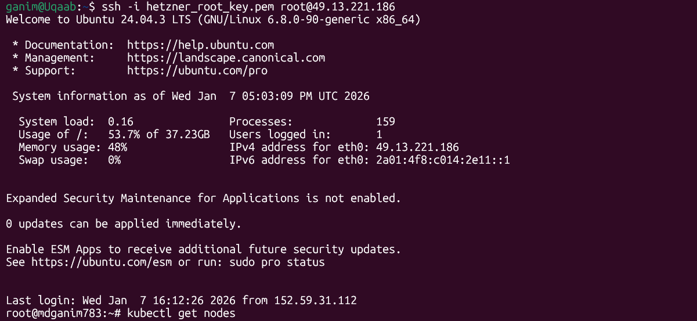
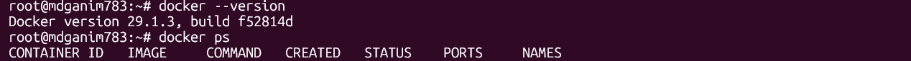
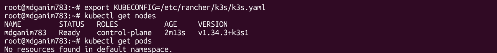
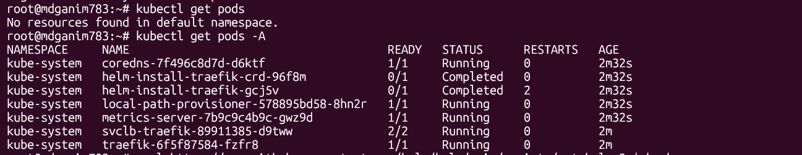
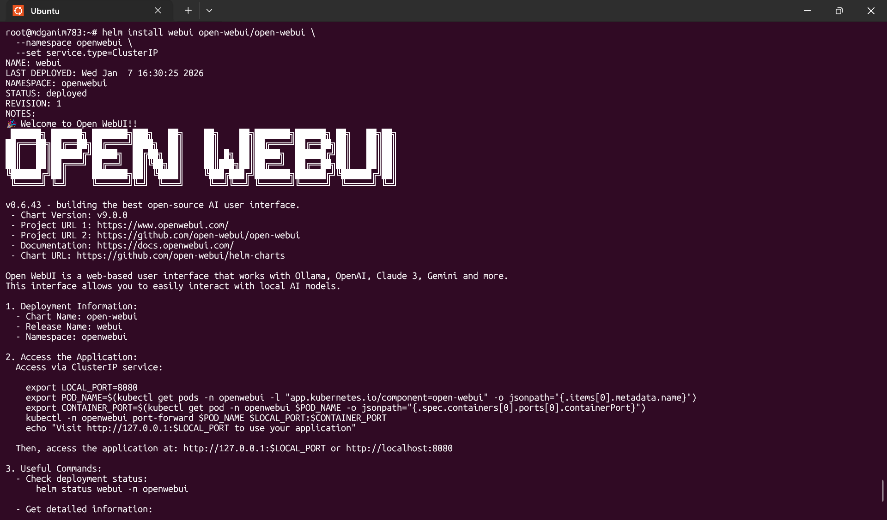
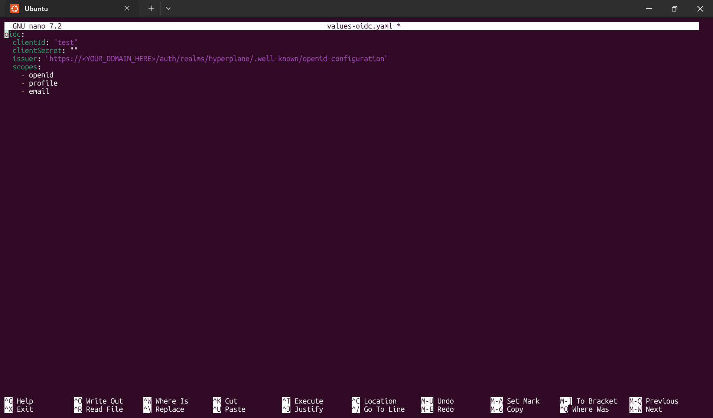
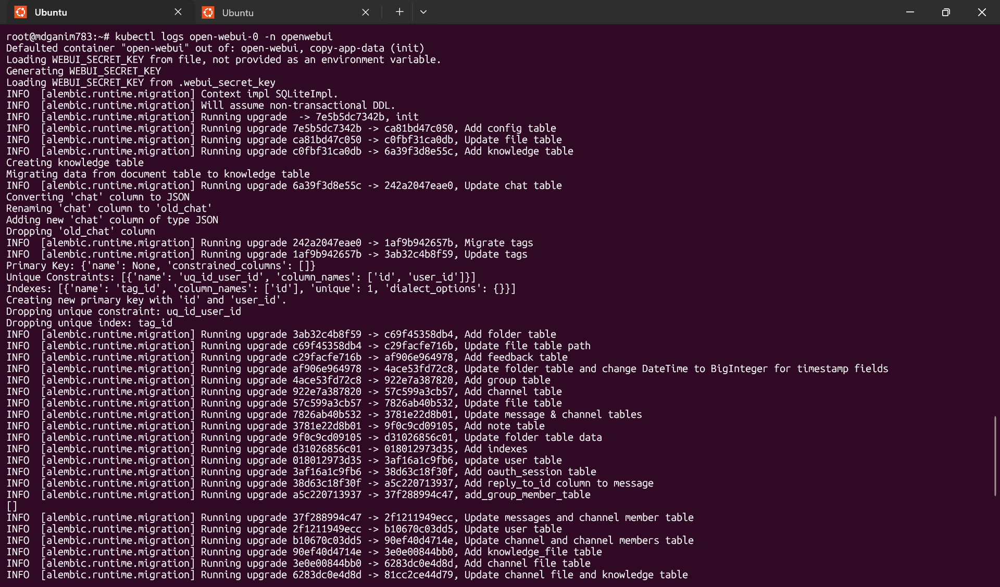

# devops-k3s-assessment

Understood.
I will do **exactly this and nothing else**:

* **ONE**
* **SINGLE**
* **Markdown (`.md`) file**
* **Entire content**
* **Inside ONE fenced code block**
* **No explanations, no prose outside, no splitting**

Here it is.

````markdown
# Infrastructure DevOps Intern Assessment – Hetzner

This repository documents the end-to-end setup, deployment, debugging,
and operational reasoning for the Infrastructure Owner assessment.

The focus is on execution, debugging ability, security thinking,
cost awareness, and ownership of production infrastructure.

---

## 🧱 Environment

| Component | Value |
|---------|------|
| Cloud Provider | Hetzner Cloud |
| OS | Ubuntu 24.04 |
| VM Access | SSH (root) |
| Kubernetes | k3s (single-node) |
| Container Runtime | Docker |
| Package Manager | Helm |
| Application | Open WebUI |

---

## 🏗 High-Level Architecture

- Single VM running Docker + k3s
- Open WebUI deployed via Helm
- Supporting components:
  - Redis
  - Pipelines
  - Ollama
- OIDC enabled intentionally to demonstrate runtime failure diagnosis

---

## 🚀 Implementation Walkthrough (with Evidence)

### 1️⃣ Secure VM Access

- SSH access using the provided private key
- Verified OS, disk space, and memory availability



---

### 2️⃣ Docker Installation & Validation

```bash
apt update && apt upgrade -y

apt install -y ca-certificates curl gnupg

curl -fsSL https://download.docker.com/linux/ubuntu/gpg \
  | gpg --dearmor -o /etc/apt/keyrings/docker.gpg

apt install -y docker-ce docker-ce-cli containerd.io

systemctl enable docker
systemctl start docker

docker version
docker ps
```



---

### 3️⃣ Kubernetes Setup (k3s)

```bash
curl -sfL https://get.k3s.io | sh -
```

```bash
export KUBECONFIG=/etc/rancher/k3s/k3s.yaml
```

```bash
kubectl get nodes
kubectl get pods -A
```




---

### 4️⃣ Helm & Application Deployment

```bash
curl https://raw.githubusercontent.com/helm/helm/main/scripts/get-helm-3 | bash
```

```bash
helm repo add open-webui https://helm.openwebui.com/
helm repo update
```

```bash
kubectl create namespace openwebui
```

```bash
helm install webui open-webui/open-webui \
  --namespace openwebui \
  --set service.type=ClusterIP \
  --dry-run
```

```bash
helm install webui open-webui/open-webui \
  --namespace openwebui \
  --set service.type=ClusterIP
```

```bash
kubectl get all -n openwebui
```



---

### 5️⃣ OIDC Configuration (Intentional Failure)

#### values-oidc.yaml

```yaml
oidc:
  clientId: "test"
  clientSecret: ""
  issuer: "https://<YOUR_DOMAIN_HERE>/auth/realms/hyperplane/.well-known/openid-configuration"
  scopes:
    - openid
    - profile
    - email
```

```bash
helm upgrade webui open-webui/open-webui \
  --namespace openwebui \
  --values values-oidc.yaml
```



---

## 🧪 Debugging the Intentional Failure

### Observed Behavior

- Pods are Running
- Application starts successfully
- OIDC authentication fails only when triggered

---

### Diagnosis

```bash
kubectl get pods -n openwebui
```

```bash
kubectl logs open-webui-0 -n openwebui
```



---

### Root Cause

The OIDC provider uses a self-signed TLS certificate that is not trusted
by the container’s default CA bundle. TLS verification fails during
OIDC discovery and token validation.

---

### Production-Grade Fix

- Store custom CA certificate in a Kubernetes ConfigMap
- Mount it into the application pod
- Update the container trust store or set SSL_CERT_FILE
- Do not bypass TLS verification

---

## 📊 Validation Outputs

```bash
kubectl get nodes
kubectl get all -n openwebui
```

---

## 🧠 Ownership & Production Considerations

### Production Readiness Gaps

- Single-node cluster (single point of failure)
- No automated backups
- No monitoring or alerting
- No autoscaling
- No enforced resource limits
- Secrets not centrally managed

---

### Failure Scenario (2 AM Node Failure)

- Entire application goes down
- Recovery requires VM restore, k3s reinstall, data restore, redeployment
- Mitigation: redundancy, backups, alerts, Infrastructure-as-Code

---

### Security & Secrets

- Use Kubernetes Secrets or external secret managers
- Never commit secrets to Git
- Rotate credentials, tokens, and certificates regularly

---

### Backups & Recovery

- Backup databases, persistent volumes, and configuration
- Daily automated backups
- Periodic restore testing

---

### Cost Ownership (Hetzner)

- Single-node k3s is cost-efficient early
- Right-size VM resources
- Avoid premature managed services
- Move to HA Kubernetes when required

---

## ✅ Key Takeaways

- Lightweight Kubernetes fits early-stage workloads
- Many failures occur at runtime, not startup
- Secure-by-default fixes matter more than quick hacks
- Infrastructure ownership means planning for failure
````
